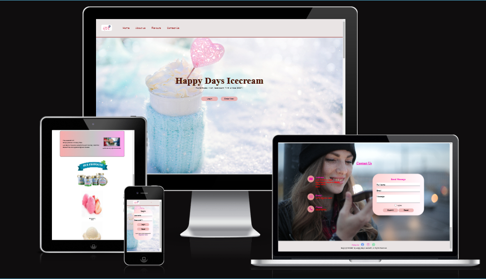
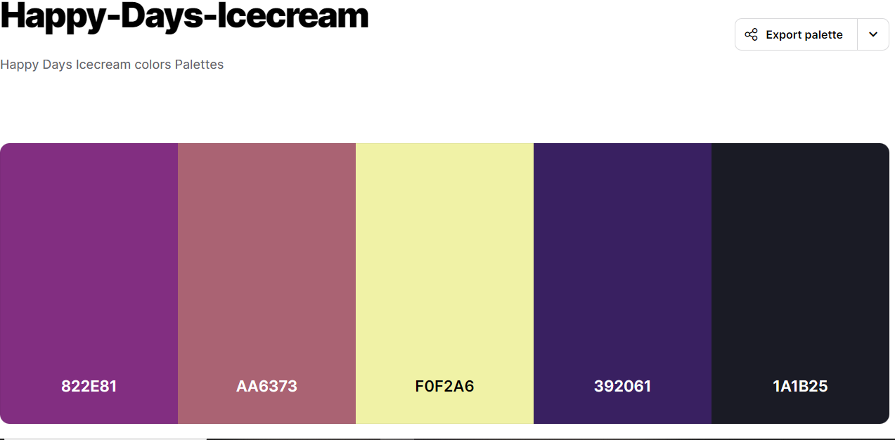
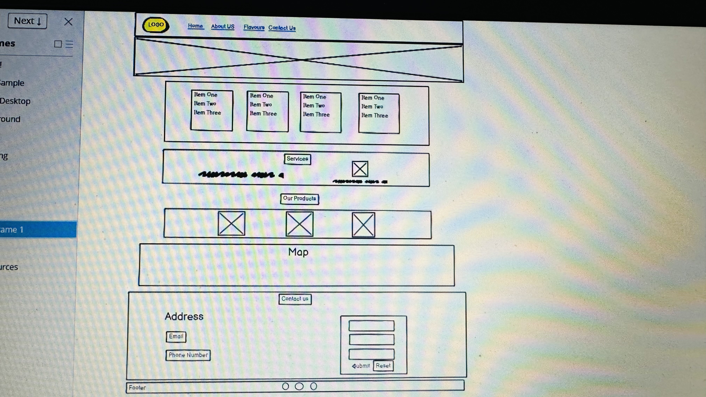

<link rel="stylesheet" href="assets/css/style.css">

<h1>Happy Days Icecream Website

Welcome to the Happy Days Icecream Website is designed to be responsive website allowing visitors to view on a range of devices. It allows visitors to find out about the Happy Days Icecream shop.

 
<a class="text-color" href="https://mandeep-k724.github.io/Happy-Days-Icecream/">Surf the Happy Days Icecream Website here\</a>

<h2>Contents</h2>

<h3>User Experience (UX)</h3>
<li>Initial Discussion

<li>User Stories</li>

 

<h3>Design</h3>

<li>Colour Scheme

<li>Typography

<li>Wireframes

<li>Features

<li>Accessibility</li>

 

<h3>Technologies Used</h3>

<li>Languages Used

<li>Frameworks, Libraries & Programs Used</li>

 

<h3>Deployment & Local Development</h3>

<li>Deployment

<li>Local Development

<li>How to Fork

<li>How to Clone</li>

 

<h3>Testing</h3>

<li>W3C Validator

<li>Solved Bugs

<li>Known Bugs

<li>Testing User Stories

<li>Lighthouse

<li>Index Page

<li>Books Page

<li>Contact Us Page

<li>Thank You Page

<li>Full Testing</li>
 

<h3>Credits</h3>

<li>Code Used

<li>Content

<li>Media

<li>Acknowledgments
  

<h1 class="text-color">User Experience (UX)</h1>

<h3>Initial Discussion</h3>

Happy Days Icecream is my first project in which is html and css coding based and online platform to demonstrate my shops products and flavours and added forms and explained about our services on this website.

<h4>Key information for the site</h4>

<li>What is the current flavours.

<li>What are the upcoming flavours.

<li>How to Signup and be a member of our shop.

<li>Customers or People can enquire, questions and get recommendations by filling up contact form.

</li>

 

<h3>User Stories</h3>

<h4>Clients Goals<h4>

<li>To be able to view the site on a range of device sizes.

<li>To make it easy for potential members to find out what this website is about and how to become a member.

<li>To provide updates to their members about upcoming updates and modifications.

<li>to authorize people to become member and answering their enquiries.

<h4>First Time Customers Goals<h4>

<li>I want to find out what is this website about and how can i sign up and sign in.

<li>I want to be able to navigate the site easily to find information.

<li>I want to be able to find their social profiles.</li>

<h4>Returning Customers Goals<h4>

<li>I want to find up to date information on what the book club is reading.

<li>I want to be able to easily contact the Happy Days Icecream with my enquiries I might have.</li>

<h4>Frequent Customers Goal<h4>

<li>I want to be able to recommend a book for the book club to read.</li>

<h1 class="text-color">Design</h1>

<h2>Color Palette</h2>

Color palette of pastel colours that are often used in this website text and headings. The colour palette was created using the Coolors website.

<h2>Typography</h2>

Google Fonts was used for the following fonts:

<li>Tangerine for all headings i used for this website.

<li>roboto used as a reset and for body text which is sans serif font.

<li>i added fonts roboto(300,400),lato(300) and Oswald(300).

<h2>Imagery</h2>

All the images i used in this website is from <a href="https://www.pexels.com/">www.pexels.com</a>
 and are free(no copyright infringe).

<h2>Wireframes</h2>

Wireframes were created for desktop.

<h2>Features</h2>

The website is comprised of four pages, one of home page and contact us form is accessible from navigation menu lists and others forms can be accessible from buttons on  the main header section.The fourth page is a form submission confirmation page which is shown once a user submits the form on the contact us,all other three forms on other pages.

 

<h4>Home  Page</h4>

<li>A logo of website and navigation bar(about us,Services,Flavours,Contact Us) which is responsive  on all pages.

<li>When viewing with mobile devices the navigation links change to a burger toggler. This was implemented to give the site a clean look and to promote a good user experience, as users are used to seeing the burger icon when on mobile devices to navigate a site.

<h4>Footer</h4>

<li>Footer is there with all social links and icons to bring to social platforms.</li>

<h4>Contact Us</h4>

<li>To get enquiries from customers they need contact form where they will be asking to fill name,email message and check box to confirm and finally submit.</li>

<h4>Sign In Form</h4>

<li>This form has name and email feild and submit and reset button where after filling there information they can login or reset the form.</li>

<h4>Sign Up Form</h4>

<li>This form has name, email and feild to choose and to reenter there password to become a member and submit and reset button where after filling there information they can signup or reset the from reset button.</li>

<h4>Order Form</h4>

<h4>Thank You Page</h4>

<li>A message thanks the user for submitting the form and lets them know someone will be in touch soon.</li>
<h2>Accessibility</h2>

I have been mindful during coding to ensure that the website is a User Friendly.

<li>Using semantic HTML.

Using descriptive alt attributes on images on the site.

<li>Providing information for screen readers where there are icons used and no text - such as the review ratings for books & footer icons.

<li>Ensuring that there is a sufficient colour contrast throughout the site.

<li>Ensuring menus are accessible by marking the current page as current for screen readers.

<h3>Future Implementations.</h3>

<li>Use javascript to perform return to top function on Website.

<li>A meet the members page - This would have a photo of the member together with a small bio. A link to their instagram and/or goodreads page.

<li>Competitions/giveaways page - This page would give further information/rules on the competitions and giveaways.

<h2>Languages Used</h2>

HTML,CSS.

<h2>Frameworks, Libraries & Programs Used</h2>

Balsamiq - Used to create wireframes.

Gitpod- For version control.

Github - To save and store the files for the website.

Bootstrap Version 4.6 - The framework for the website. Code for the navigation bar, carousel, scrolls form were used and modified. Additional CSS styling was also implemented in style.css.

Google Fonts - To import the fonts used on the website.

Font Awesome icons- For the iconography on the website.

Google Dev Tools - To troubleshoot and test features, solve issues with responsiveness and styling.

<a href="https://tinypng.com/">Tiny PNG </a>To compress images.

<a href="https://favicon.io/Favicon.io">www.favicon.io</a> To create favicon.

<a href="https://ui.dev/amiresponsive">Am I Responsive?</a> To show the website image on a range of devices.

<h1>Deployment & Local Development</h1>

<h2>Testing</h2>
<a href="https://validator.w3.org/nu/#textarea">WWW.validator.w3.org</a>  

<h1 ">Credits</h1>

<h2>Deployment</h2>

Instructions to deploy this project on github.

<ol>

<li>Log in (or sign up) to Github.

Find the repository for this project, Happy Days Icecream.

<li>Click on the Settings link.

<li>Click on the Pages link in the left hand side navigation bar.

<li>In the Source section, choose main from the drop down select branch menu. Select Root from the drop down select folder menu.

<li>Click Save. Your live Github Pages site is now deployed at the URL shown.</li>

</ol>

<h2>Local Development</h2>

<h4>How to Fork</h3>

To fork the Happy Days Icecream repository:

<ol>

<li>Log in (or sign up) to <a href="https://github.com/">Github</a>.

<li>Go to the repository for this project, Mandeep-K724/Happy-Days-Icecream.

<li>Click the Fork button in the top right corner.</li>

<h4>How to Clone</h4>

<ol>

<li>Log in (or sign up) to GitHub.

Go to the repository for this project, Mandeep-K724/Happy-Days-Icecream.

<li>Click on the code button, select whether you would like to clone with HTTPS, SSH or GitHub CLI and copy the link shown.

<li>Open the terminal in your code editor and change the current working directory to the location you want to use for the cloned directory.

<li>Type 'git clone' into the terminal and then paste the link you copied in step 3. Press enter.</li>
</ol>  

<h1>Testing</h1>
Testing was ongoing throughout the entire build. I utilised Chrome developer tools while building to pinpoint and troubleshoot any issues as I went along.
<h2>W3C Validator</h2>
The W3C validator was used to validate the HTML on all pages of the website. It was also used to validate CSS in the style.css file.
  
<h1>Credits</h1>

<h2>Code Used</h2>

<li>HTML</li>

<li>CSS</li>

<h2>Content</h2>

Content for the website is written by the owner Mandeep Kaur.

<h2>Media</h2>

Website used pictures and vs code editor and logos, pictures source was <a href="https://www.pexels.com/">WWW.Pexels.Com</a>

<a href="(https://www.google.co.uk/chrome/)">Google Chrome Browser</a>

<h2>Acknowledgments\</h2>

I would like to acknowledge the following people who helped me along the way in completing my first milestone project:<a href="https://app.slack.com/client/T0L30B202/D05BLRGBBQ9"> 
Dario Carrasquel</a>,my Code Institute Mentor.
